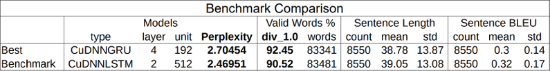

# Novel Lyrics Synthesis

In this project, Recurrent Neural Networks (RNNs) are applied to sequence modeling and Natural Language Processing (NLP) tasks. Character-level language models were trained on a tiny small dataset of 100 song lyrics (176k characters) and then used to generate new lyrics. The quality of the generated lyrics were evaluated using 3 metrics — [1] ability to form valid words, [2] emulate the original sentence structure (frequency distribution of sentence length) and [3] similarity (BLEU score).

## Table of Contents

* [Summary of findings](#summary-of-findings)
* [Results](#results)
* [Metrics](#metrics)
    * [1. Valid Words percentage](#1-valid-words-percentage)
    * [2. Sentence Length](#2-sentence-length)
    * [3. Sentence BLEU](#3-sentence-bleu)
* [Data pre-processing](#data-pre-processing)
* [Benchmark](#benchmark)
* [Implementations](#implementations)
* [References](#references)
* [Source code: nls.ipynb](https://github.com/danieltjw/novel-lyrics-synthesis/blob/master/nls.ipynb)

## Summary of findings

- The latest cuDNN accelerated GRUs brought about a 7.3x / 6.7x speed up in training time compared to non-cuDNN GRU implementation 1 / 2 respectively.
- GRU networks with shorter sequence length (10, 20) are not able to properly emulate the sentence length of the original corpus (M=33.65, SD=11.8). These networks' sentences have a significantly higher standard deviation (23.7, 16.6) compared to the original corpus. The mean sentence length was relatively consistent. 
  - **This shows that networks with shorter sequence lengths are unable to properly emulate the frequency distribution of structures that exceed those lengths.**
- Perplexity has a moderate negative correlation (r=-0.632, DF=15; P<0.01) with the valid words percentage (1st metric). This indicates that the 1st metric measures some variability that is independent from perplexity. 
- Lower perplexity does not guarantee a better language model—at least for the task of forming valid words (1st metric): [Benchmark](#benchmark)
- GRUs performs just as well as LSTMs but also with a notably faster training time (total parameters of each best model after hyper-parameter search: GRU: 803,360, LSTM: 11,937,824).

## Results

_Note: GRU network sequence length: 50, Batch size: 128_

---

_Note: GRU network sequence length: 50, Batch size: 128_

## Metrics

### __1. Valid Words percentage__

T*h*is m*e*tric eva*l*uates the model’s ability to generate non-gibberish words. The *p*ercentage of valid words over all words generated is calculated. Words are defined as strings of characters delimited by space or newline characters.

[SCOWL (Spell Checker Oriented Word Lists)](https://github.com/en-wl/wordlist) was found to be the best dictionary word list for the task. Comparatively, the [NLTK (Natural Language Toolkit) word list](https://www.nltk.org/book/ch02.html#wordlist-corpora) was found to be inadequate as only 72% of the lyrics’ words were found within it, compared to the 97% in the SCOWL.

A reduced SCOWL dictionary (scowl size: 50) was used instead of the default (scowl size: 60) as it was found to contain less unsuitable words. For example, the word ‘ot’ was found in the latter but not in the former.

Furthermore, words that were 1-2 letters long (412 in total) were manually screened so as to remove words that are not common in lyrics. This helped reduce the number of false positives that might have resulted in an overly exaggerated score.

> Dictset (Valid Words) = Words in lyrics + Words in SCOWL

### __2. Sentence Length__

The sentence length metr*i*cs measures the ability of the model to emulate the sentence length of the original corpus. The sentence length is based on the distance between newlines (*‘*\n’) characters, inclusive of the last ending newline. Sentences of length 0, such as those used in paragraph breaks (‘\\*n*\\*n*’), are not considered.

### __3. Sentence BLEU__

The [sentence BLEU (BiLingual Evaluation Understudy) score](http://www.nltk.org/api/nltk.translate.html#nltk.translate.bleu_score.sentence_bleu) implementation in NLTK (N*a*tural *L*anguage ToolK*i*t) will be used as an e*v*aluation m*e*tric on how similar the generated sentences are compared to the existing lyrics. BLEU score has been a mainstay in the assessment of machine translation tasks ([Papineni, Roukos, & Ward, 2002](https://www.aclweb.org/anthology/P02-1040.pdf)). A preferred score would be one in the goldilocks zone—not too high which would indicate it being too similar and boring, but also not to low which may be too unfamiliar. 

As sentence-level BLEU score will be used instead of corpus-level one, a [smoothing function](https://www.nltk.org/api/nltk.translate.html#nltk.translate.bleu_score.SmoothingFunction.method3) ([Chen & Cherry, 2014](http://acl2014.org/acl2014/W14-33/pdf/W14-3346.pdf)) was added to address null n-gram count.

## Data pre-processing

The lyrics included in the corpus should reflect an artist's style. These steps were taken to decide which lyrics would make up the corpus. Personal judgment was used in the last step.

1. Remove cover songs
2. Remove songs where artist has no writing credits
3. Remove songs not in official releases (Albums, EPs, Singles)
4. Remove song collaborations which did not fit artist’s style

The 100 songs which would form the corpus were sourced from [https://genius.com](https://genius.com). As those lyrics were transcribed and annotated by volunteers, the quality varied greatly. 

Song section annotation [Verse], [Chorus], [Bridge] was time-consuming to check and correct—requiring listening to each section interpreting them in the context of the song.

How sentences were partitioned was also quite arbitrary. Lyrics, unlike other texts, do not have a convention on when to start a new sentence. My preference was on breaking sentences according to the musical phrasing rather than grammatically.

The lyrics were standardised using text replacements and regular expressions:

- Quotes: Remove single, double and standard { " } and non-standard { “ ” }
- Punctuations: Remove { ! }, { ? }, { ‽ }, { : }, { … }, { — }
- Punctuations: Replace semicolon { ; } → comma { , } 
- Abbreviations: { 2 am } → { 2 a.m. }
- Colloquialism: { in' } →  { ing }
- Numbers: { 42 } → { forty-two }
- Embellishments: Remove vocalisations (often in brackets): {(ah-aah-aah)} → {}
- Embellishments: Remove spoken words that are non-musical in nature
- Extra spaces at end of sentences: {" \n"} → {"\n"}
- Words joined by commas without delimiters { apart,now } → { apart, now }

These lyrical patterns were left intact:
- Contractions: { 'bout }, { 'cause }. These reduces the syllables of words and have an impact musically.

Once the corpus was compiled and standardised, it had to be broken down into snippets compatible with the RNNs network sequence length. Instead of simply concatenating all the lyrics, attention was paid to ensure the lyrics from adjacent songs will not bleed into each other. This is achieved be vectorising the data song-wise.

## Benchmark

The benchmark model selected was based on the well known [char-rnn](https://github.com/karpathy/char-rnn) project. It has been widely used and would be a good baseline comparison, with a caveat being that only the default hyper-parameters were used and not the implementation.

_Note: LSTM / GRU network sequence length: 50, Batch size: 128_

The best model performs better at 92.45% compared to the benchmark’s 90.52%. Interestingly, the perplexity of the benchmark model is lower at 2.47 compared to the best model’s 2.7. It seems a lower perplexity does not guarantee a better language model—at least for the task of forming valid words (1st metric).

## Implementations

- Early stopping during model training to optimise computational resources
- Custom hyper-parameter search that enabled network sequence length variation
- Automated workflow that streamlined the training and evaluation of multiple models
- Additional features, such as the spreadsheet reports, facilitated a more organised research process

## References

[Jeffrey L. Elman. Finding structure in time. Cognitive Science 14(2):179–211, 1990.](https://crl.ucsd.edu/~elman/Papers/fsit.pdf)

[Sepp Hochreiter and Jürgen Schmidhuber. Long short-term memory. Neural computation 9(8):1735–1780, 1997.](http://www.bioinf.jku.at/publications/older/2604.pdf)

[Kyunghyun Cho, Bart van Merriënboer, Dzmitry Bahdanau, and Yoshua Bengio. On the properties of neural machine translation: Encoder-decoder approaches. Eighth Workshop on Syntax, Semantics and Structure in Statistical Translation, 2014.](https://arxiv.org/pdf/1406.1078.pdf)

[Kishore Papineni, Salim Roukos, Todd Ward, and Wei-Jing Zhu. BLEU:  A Method for Automatic Evaluation of Machine Translation. ACL-2002, 2002.](https://www.aclweb.org/anthology/P02-1040.pdf)

[Boxing Chen and Colin Cherry. A Systematic Comparison of Smoothing Techniques for Sentence-Level BLEU. In Proceedings of the Ninth Workshop on Statistical Machine Translation, pages 362–367, 2014.](http://acl2014.org/acl2014/W14-33/pdf/W14-3346.pdf)

[Junyoung Chung, Caglar Gulcehre, KyungHyun Cho, Yoshua Bengio. Empirical evaluation of gated recurrent neural networks on sequence modeling, 2014.](http://arxiv.org/abs/1412.3555)

[Yann LeCun, Ido Kanter, and Sara A. Solla. Second-order properties of error surfaces: learning time and generalization. Advances in Neural Information Processing Systems, vol. 3, pp. 918-924, 1991.](http://papers.nips.cc/paper/314-second-order-properties-of-error-surfaces-learning-time-and-generalization.pdf)

[Alex Graves, Abdel-rahman Mohamed, Geoffrey Hinton. Speech recognition with deep recurrent neural networks. In Acoustics, Speech and Signal Processing (ICASSP), 2013 IEEE International Conference on, pp. 6645–6649. IEEE, 2013.](https://arxiv.org/abs/1303.5778)

[Rafal Jozefowicz, Wojciech Zaremba, and Ilya Sutskever. An empirical exploration of recurrent network architectures. In Proceedings of the 32nd International Conference on Machine Learning (ICML-15), pages 2342–2350, 2015.](http://proceedings.mlr.press/v37/jozefowicz15.pdf)

## Source code
Jupyter notebook: [nls.ipynb](https://github.com/danieltjw/novel-lyrics-synthesis/blob/master/nls.ipynb)

