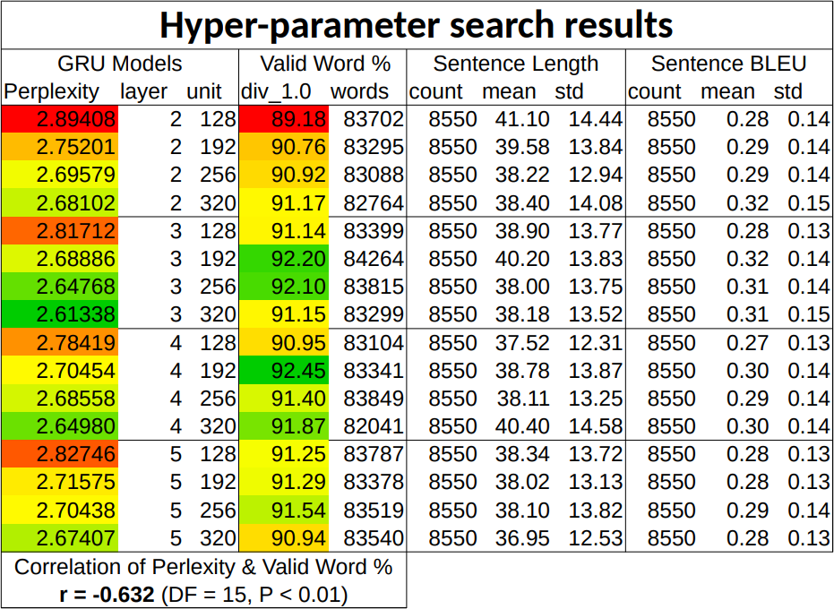
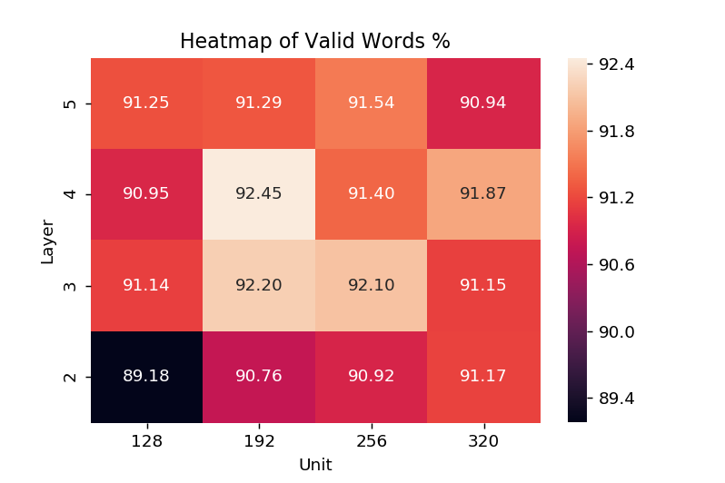

# Novel Lyrics Synthesis

In this project, Recurrent Neural Networks (RNNs) are applied to sequence modeling and Natural Language Processing (NLP) tasks. Character-level language models were trained on 100 song lyrics and then used to generate new lyrics. The quality of the generated lyrics were evaluated using 3 metrics—ability to form valid words, emulate the original sentence structure (frequency distribution of sentence length) and similarity (BLEU score).

## Summary of findings:

- The latest CuDNN accelerated GRUs brought about a 7.3x / 6.7x speed up in training time compared to non-CuDNN GRU implementation 1 / 2 respectively.
- Perplexity has a moderate negative correlation (r=-0.632, DF=15; P<0.01) with the valid words percentage (1st metric). This indicates that the 1st metric measures some variability that is independent from perplexity. 
- Lower perplexity does not guarantee a better language model—at least for the task of forming valid words (1st metric).
- GRU networks with shorter sequence length (10, 20) are not able to properly emulate the sentence length of the original corpus. These networks' sentences have a significantly higher standard deviation (23.7, 16.6) compared to the original corpus (11.8). The mean sentence length of across different models did not vary greatly. This shows that while shorter models can adequately learn the frequency of newline chars, they struggle with emulating the structure (frequency distribution) of the original lyrics.

## Results:

_Note: GRU network sequence length: 50, Batch size: 128_

---

_Note: GRU network sequence length: 50, Batch size: 128_

## Metrics

1. Valid Words percentage

T*h*is m*e*tric eva*l*uates the model’s ability to generate non-gibberish words. The *p*ercentage of valid words over all words generated is calculated. Words are defined as strings of characters delimited by space or newlines characters.

[SCOWL (Spell Checker Oriented Word Lists)](https://github.com/en-wl/wordlist) was found to be the best dictionary word list for the task. Comparatively, the [NLTK (Natural Language Toolkit) word list](https://www.nltk.org/book/ch02.html#wordlist-corpora) was found to be inadequate as only 72% of the lyrics’ words were found within it, compared to the 97% in the SCOWL word list.

A reduced SCOWL dictionary (scowl size: 50) was used instead of the default (scowl size: 60) as it was found to contain less unsuitable words. For example, the word ‘ot’ was found in the latter but not in the former.

Furthermore, words that were 1-2 letters long (412 in total) were manually screened so as to remove words that are not common in lyrics. This helped reduce the number of false positives that might have resulted in an overly exaggerated score.

`Dictset (Valid Words) = Words in lyrics + Words in SCOWL wordlist`

2. Sentence length

The sentence length metr*i*cs measures the ability of the model to emulate the sentence length of the original corpus. The sentence length is based on the distance between newlines (*‘*\n’) characters, inclusive of the last ending newline. Sentences of length 0, such as those used in paragraph breaks (‘\\*n*\\*n*’), are not considered.

3. Sentence BLEU

The [sentence BLEU (BiLingual Evaluation Understudy) score](http://www.nltk.org/api/nltk.translate.html#nltk.translate.bleu_score.sentence_bleu) implementation in NLTK (N*a*tural *L*anguage ToolK*i*t) will be used as an e*v*aluation m*e*tric on how similar the generated sentences are compared to the existing lyrics. BLEU score has been a mainstay in the assessment of machine translation tasks ([Papineni, Roukos, & Ward, 2002](https://www.aclweb.org/anthology/P02-1040.pdf)). A preferred score would be one in the goldilocks zone—not too high which would indicate it being too similar and boring, but also not to low which may be too unfamiliar. 

As sentence-level BLEU score will be used instead of corpus-level one, a [smoothing function](https://www.nltk.org/api/nltk.translate.html#nltk.translate.bleu_score.SmoothingFunction.method3) ([Chen & Cherry, 2014](http://acl2014.org/acl2014/W14-33/pdf/W14-3346.pdf)) was added to address null n-gram count.

## Implementations:

- A custom hyper-parameter search was implemented to allow for network sequence length variation.
- Two evaluation metrics (valid words and sentence length) were designed and implemented, and used to draw insights on hyper-parameters' impact on learning.
- An automated workflow was developed that allow multiple models to be trained and evaluated. 
- Additional features, such as the spreadsheet reports, were integrated into the code to make the research process more organised.
